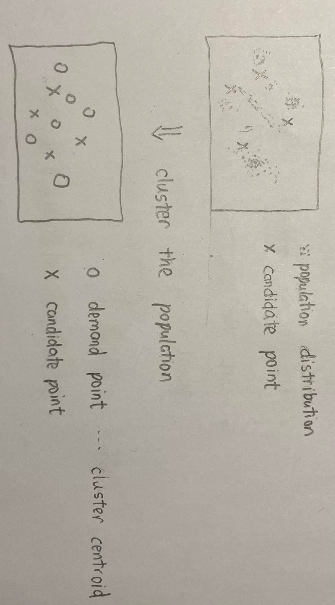

# 核酸检测亭选址问题——Based on P-Median

## Scene

## Hypothesis
- 人不能自主选择核酸检测点和检测时间（避免博弈）

## Problem Formulation

- 需求点（population cluster）集合: $N$
- 候选点（核酸检测亭）集合：$M$
- 候选点数量：$P$
- 需求点$i$到候选点$j$的距离：$d_{ij}$
- 需求点$i$的需求数：$q_i$
- 候选点$j$的容量上限（每个核酸检测亭能接待的人数）：$\overline{Q_j}$

$min \; \Sigma_{j=1}^{\left|{M}\right|} \Sigma_{i=1}^{\left|{N}\right|} d_{ij}x_{ij}q_{i}$ 

$s.t$

$\Sigma_{j=1}^{\left|{M}\right|} x_{ij} = 1, \forall{i} = 1, 2,..., \left|{N}\right|$

$\Sigma_{j=1}^{\left|{M}\right|} y_j = P$

$\Sigma_{j=1}^{\left|{N}\right|} x_{ij} q_i \le \overline{Q_j}$

$x_{ij} \le y_j, \forall{i} = 1, 2,..., \left|{N}\right|, \forall{j} =  1, 2,..., \left|{M}\right|$

$x_{ij}= 
\left\{ 
    \begin{array}{lc}
        1 & 需求点i被候选点j覆盖 \\
        0 & otherwise\\
    \end{array}
\right.$

$y_j= 
\left\{ 
    \begin{array}{lc}
        1 & 候选点j被选择 \\
        0 & otherwise\\
    \end{array}
\right.$

## 聚类计算
- 人口分布中的每个点可以被表示为 $(lat, lon, pop)$， $lat, lon$表示经纬度，$pop$表示该点常驻人口
- 使用聚类算法对点集聚类（e.g KMeans）
- 得到聚类质心 $(lat_c, lon_c, pop_c)^{(i)} ,\; \forall{i} = 1, 2,..., \left|{N}\right| $
- $q_i = \frac{pop_c}{num \;time span} $, $num \;time span$为核酸检测的时间段的数量, 假设时间段等长——这里为每个时间段理想地安排等量的人数

## 容量上限计算
- 获取每个检测亭的可用面积: $S_j$
- 给出人与人间距要求: $D$
- 容量上限：$\overline{Q_j} = \frac{S_j}{\pi D^2}$ ——这里认为一个人为圆心$D$为半径的区域内都不允许有人

## 挑战1：数据
1. 导航距离
2. 人口数量——时间动态、人的选择——这里使用过强的假设缓解

## 挑战2：决策
1. 检测亭的面积、需要的人数、工种
2. 检测时间
3. 各个时间段安排多少人

## 挑战3：目标
1. 建亭成本
2. 检测亭到医院的距离
3. 人与人间距（交叉感染的人数）
4. 每个时间段内到达的人数

## 挑战4：约束
1. 一个需求点(人口分布聚类质心)应该被多个候选覆盖
2. 完成检测任务的的时间要求（如24小时内）